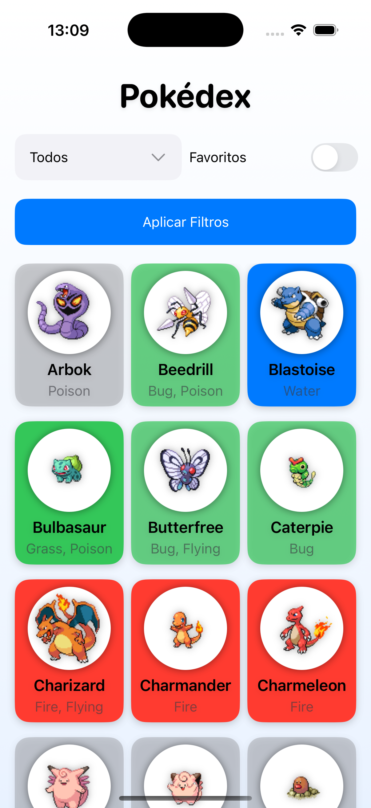
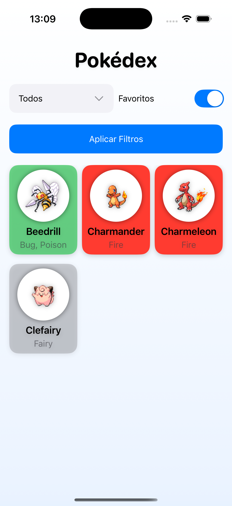
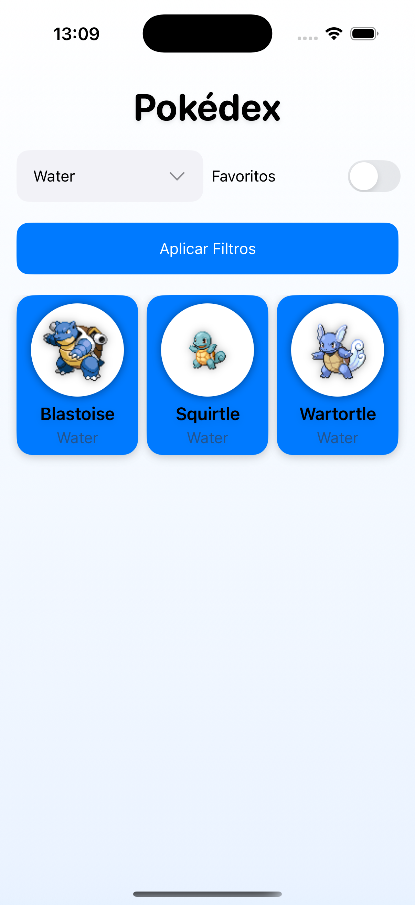
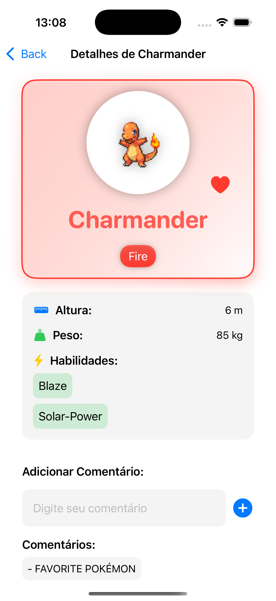

# Pokedex_Swift
Aplicativo de Pokédex desenvolvido para iOS utilizando Swift, como parte do curso do CESAE.

## Funcionalidades
O **Pokedex_Swift** permite aos usuários explorar e interagir com uma vasta lista de Pokémon. Ele oferece as seguintes funcionalidades:

- **Página inicial:** Visualize todos os Pokémon disponíveis em um layout limpo e intuitivo.
- **Favoritos:** Marque e acesse facilmente seus Pokémon favoritos.
- **Filtro por tipo:** Encontre Pokémon específicos filtrando por tipo, como Fogo, Água, Planta, entre outros.
- **Detalhes do Pokémon:** Consulte informações detalhadas sobre cada Pokémon, adicione comentários e marque como favorito.

---

### Página Inicial  

Nesta página, você pode navegar por toda a lista de Pokémon disponíveis, exibida de forma simples e visualmente agradável.

---

### Pokémon Favoritos  

A seção de favoritos permite que você acompanhe os Pokémon que marcou como preferidos.

---

### Filtro por Tipo de Pokémon  

Filtre Pokémon por tipo e encontre rapidamente seus favoritos, como Elétrico, Fantasma ou Fada.

---

### Detalhes do Pokémon  

Veja informações detalhadas sobre o Pokémon, como habilidades, descrições e estatísticas. Também é possível adicionar comentários e marcar como favorito.

---

## Integração com API
Este aplicativo utiliza a [Pokémon API](https://www.pokemon.com/us/pokedex/) para buscar dados atualizados sobre os Pokémon. A API fornece informações como:
- Nome e descrição.
- Tipo e habilidades.
- Imagens oficiais.

## Tecnologias Utilizadas
- **Linguagem:** Swift
- **Frameworks:** UIKit
- **Integração com API:** Consumo de dados JSON da Pokémon API.
- **Design Responsivo:** Interface pensada para oferecer uma ótima experiência de usuário.

---

Desenvolvido com dedicação durante o curso do CESAE. 🚀  
